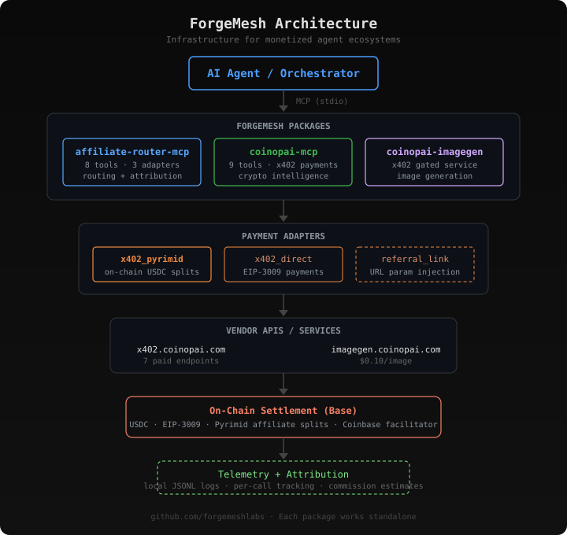

# ForgeMesh

Infrastructure for monetized agent ecosystems.

ForgeMesh is a set of composable tools for building AI agents and workflows that earn
revenue — through programmable micropayments, affiliate attribution, and paid API access.

Each package is independently installable. They work together but do not require each other.

---

## Packages

| Package | Purpose | Install |
|---------|---------|---------|
| [affiliate-router-mcp](https://github.com/forgemeshlabs/affiliate-router-mcp) | Vendor-neutral monetization routing for agent tools | `npm i affiliate-router-mcp` |
| [coinopai-mcp](https://github.com/forgemeshlabs/coinopai-mcp) | Paid crypto intelligence via x402 micropayments | `npm i coinopai-mcp` |
| [coinopai-imagegen](https://github.com/forgemeshlabs/coinopai-imagegen) | Paid image generation service on Base | (backend service) |

---

## Architecture

<p align="center">
  
</p>

---

## How It Works

### MCP Tools

Each package is an [MCP](https://modelcontextprotocol.io) server. Agents connect via stdio
and call tools like any other MCP integration. No SDK lock-in — works with Claude Code,
Claude Desktop, or any MCP-compatible client.

### Monetized Agent Ecosystems

Agents pay per call using [x402](https://x402.org) — the HTTP 402 micropayment protocol.
The agent's wallet signs a USDC payment on Base, the facilitator validates it on-chain,
and the endpoint returns data. No API keys. No subscriptions. Pay-per-use.

### Adapter-Based Affiliate Routing

`affiliate-router-mcp` abstracts payment and attribution into pluggable adapters:

| Adapter | How it works | Status |
|---------|-------------|--------|
| `x402_pyrimid` | On-chain USDC split via [Pyrimid](https://pyrimid.xyz) affiliate network | Tested |
| `x402_direct` | Standard EIP-3009 payment via Coinbase facilitator | Implemented |
| `referral_link` | URL parameter injection for traditional affiliate programs | Implemented |

Pyrimid/x402 is the first tested adapter. The architecture is open for any affiliate
or agent-commerce rail.

### Payment Flow

```
Agent calls tool → HTTP 402 → wallet signs USDC payment → retry with payment header → data returned
```

With affiliate attribution:
```
Agent calls tool with affiliate_id
  → USDC.approve(PyrimidRouter)
    → routePayment splits: vendor 79.2% · affiliate 19.8% · protocol 1%
      → retry with tx hash → data returned
```

The buyer always pays the listed price. The split comes from the vendor's portion.

---

## Core Principles

- **Vendor-neutral** — one interface across x402, affiliate links, SaaS programs, and future protocols
- **Adapter-based** — each payment system is a separate adapter; adding one doesn't affect others
- **MCP-native** — standard protocol, composable across agents and orchestrators
- **Local telemetry** — JSONL logs per call, no external dependencies
- **Package/product separation** — registering a new product never requires a package release

---

## What ForgeMesh Is Not

Not a framework. Not a protocol. Not a token.

A set of infrastructure packages for building agents that transact.

---

## License

MIT — [CoinOpAI](https://github.com/forgemeshlabs)
